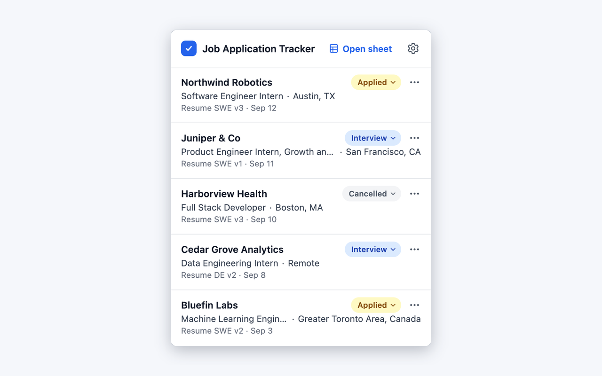
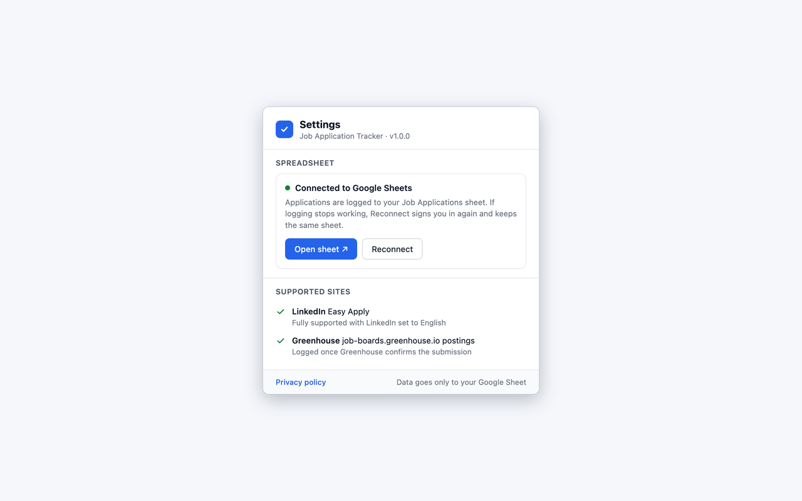

# Job Application Tracker

A Chrome extension (Manifest V3) that logs the jobs you apply to in a
Google Sheet, automatically. No copying and pasting: when you apply, the
company, job title, location, date and a link to the posting are added as
a new row.

<!-- Chrome Web Store: link goes here once the extension is published. -->





## Supported sites

- **LinkedIn Easy Apply**, with LinkedIn set to English. Jobs that send
  you to the company's own website aren't logged.
- **Greenhouse job boards** on `job-boards.greenhouse.io`. Career sites
  that show Greenhouse jobs on the company's own domain aren't covered.
- **Workday career sites** on `myworkdayjobs.com` and `myworkdaysite.com`.
  The Company column is the site's name from its address (for example
  "nvidia"), which you can change in your sheet.

## How it works

1. Open Settings and connect Google Sheets. The extension creates a new,
   formatted "Job Applications" sheet in your Google Drive. Settings names
   the sheet you're connected to from then on.
2. Apply as usual. On LinkedIn the row is logged when you click Easy
   Apply; on Greenhouse, once the site confirms your application was
   submitted, so an attempt the form rejects isn't logged; on Workday, when
   you click the application's final Submit.
3. A "Logged" notification appears for about five seconds, with an Undo
   in case you didn't mean to apply.
4. The extension's popup lists your 20 most recent applications, plus any
   still waiting to be saved. From there you can change an application's
   status or note, or open the job posting. Changes are written to your
   sheet.

## Features

- **Automatic logging per site.** Each supported site has its own parser
  and its own trigger: the Easy Apply click on LinkedIn, the confirmation
  page on Greenhouse.
- **The popup.** Each row shows the company, title, location and date,
  with the status from your sheet. A dropdown sets the status (Applied,
  Interview, Offer, Rejected, Cancelled) — every logged row starts as
  Applied — and the row's ⋯ menu edits the row's note or opens the job
  posting. A row is only written if its Company and Title still
  match, so a row you've sorted or renamed by hand is never overwritten.
  A line at the top counts this week's applications (Monday to Sunday)
  and your interviews.
- **Notes.** "Add note" opens the row's Notes cell, saves your edit back
  to it, and refuses if that cell changed in your sheet since you opened
  it, so a note you wrote there is never overwritten unseen.
- **Applications still waiting** to be saved are listed too, at their
  dates, with a Waiting chip and no actions until they land in the sheet.
- **Dark mode.** The popup, Settings and the editors follow your system's
  light or dark theme.
- **The "Logged" notification.** Undo marks the row Cancelled rather than
  deleting it, so an application you didn't mean to make is corrected in
  one click. It's the only button: a note is written later, from the
  popup.
- **A retry queue.** If a save fails (offline, or a lapsed sign-in), the
  application is queued instead of dropped and retried every 5 minutes.
  Reopening Easy Apply for the same job within 24 hours doesn't log a
  second row, unless you cancelled the first.
- **Sign-in needed.** If Google access lapses, the extension says so with
  a badge, a notification and a banner in the popup, holds new
  applications, and saves them as soon as you reconnect.
- **A sheet in the trash or deleted.** The extension asks Google Drive
  whether your sheet is in the trash. If it is, or it's gone, it stops
  writing, tells you, and Settings offers "Open Drive's trash" and
  "Create a new sheet". Restoring the sheet clears the warning and the
  waiting applications land.
- **Which sheet you're connected to, and starting a new one.** Settings
  names the connected sheet and links to it. "Start a new sheet" (behind a
  confirmation) leaves the current one untouched in your Drive and logs
  future applications to a fresh sheet named with its date, for example
  "Job Applications (from 2026-09-17)"; the popup's recent list is cleared,
  since those rows are in the old sheet. While a previous sheet is
  remembered, Settings offers "Switch back to the previous sheet", which
  checks it's still there and not in the trash first.
- **The sheet itself** is formatted on creation: a frozen blue header,
  banded rows, a date format, per-column widths, and a Status column with
  a dropdown and colour rules. A hidden "Log ID" column holds a random id
  per row, used only so a retry can't save the same application twice.
- **A Summary tab**, also created with the sheet: a total logged and the
  totals by status, this week, last week and the 8-week average, and the
  last 8 weeks with a count and a small bar. It's made of
  formulas over your applications, so it keeps itself up to date as rows
  arrive, and the extension never writes to it. Delete it if you don't
  want it — nothing else depends on it.

## Why didn't it log?

- **LinkedIn isn't in English.** Detection is fully supported with
  LinkedIn's interface set to English.
- **The job sends you off-site.** "Apply on company website" leaves
  LinkedIn, and the extension doesn't follow you there.
- **A Greenhouse job on the company's own domain.** Only
  `job-boards.greenhouse.io` is covered.
- **No sheet connected, or Google sign-in lapsed.** The popup says so and
  the application waits; connect or reconnect and it's saved.
- **You were offline.** The application is queued and retried every 5
  minutes.
- **Your sheet is in Drive's trash or deleted.** Nothing is written until
  you restore it or create a new one.
- **The same job again within 24 hours.** Deliberate, so reopening Easy
  Apply doesn't log twice.

## Privacy

The extension talks only to Google: the Sheets API, to read and write the
sheet it created, and the Drive API, only to check whether that sheet is
in the trash. It can only access files it created. There's no other
server and no analytics. Its use of information received from Google APIs
adheres to the Google API Services User Data Policy, and will adhere to
the Chrome Web Store User Data Policy, including the Limited Use
requirements. Full policy:
https://rynjung1.github.io/job-app-tracker/privacy.html

## Permissions

- `storage`: on your device only: your connected sheet; applications
  waiting to be saved; briefly, a Greenhouse job's details between your
  Submit click and Greenhouse's confirmation (session storage, cleared
  when the browser closes, unused after 30 minutes); your 20 most recent
  applications;
  while Google sign-in is needed, when that happened and the error message
  from Chrome or Google; if your sheet is moved to Google Drive's trash or
  deleted, which of the two and when; the sheet a "Start a new sheet"
  replaced, so you can switch back to it; and, while Settings is open, its
  window's number (session storage). No sign-in credential: Chrome keeps the Google token.
- `identity`: signs you in to Google, with access limited to files the
  extension creates.
- `alarms`: retries saving applications after a network or sign-in
  problem.
- `notifications`: the "Logged", "Not connected", "Sign-in needed", "Undo
  didn't go through" and "Your sheet is in Google Drive's trash" / "Your
  sheet was deleted" notices.
- `https://sheets.googleapis.com/*`: reads and writes your sheet through
  the Google Sheets API.
- `https://*.myworkdayjobs.com/*`, `https://*.myworkdaysite.com/*`: after
  a Workday application's final Submit, reads that one job's public
  details from the same career site, without your Workday cookies.
- It runs on LinkedIn, Greenhouse job boards and Workday career sites.
  LinkedIn and Workday move between pages without reloading them, so its
  code is loaded on every page of those sites, but it acts only on job
  pages: it reads the job details when you click Easy Apply or Submit
  application; on Workday it reads nothing until the final Submit.

## For developers

### How it's put together

```
content script (per site)          background service worker           Google
  detects the job page               checks every message's origin       Sheets API
  reads title/company/location  -->  validates the payload        -->    (your sheet)
  at the Apply/Submit click          builds and sanitizes the row
                                     appends it, or queues it            Drive API
  popup / Settings page              holds the OAuth token               (is the sheet
  never call Google directly    -->  owns every API call                  in the trash?)
```

- **Content scripts** (`src/content/`, `src/parsers/`) only read the page
  and send a message. They never touch the spreadsheet.
- **The background worker** (`src/background/`) is the only component
  with the OAuth token and the only caller of the spreadsheet provider.
  It verifies each message's sender origin, validates the fields, and
  writes the row.
- **Internal messages** from the popup and Settings, over one contract
  checked against the extension's own origin: `CONNECT_PROVIDER`,
  `RECONNECT_PROVIDER`, `CREATE_NEW_SHEET`, `SWITCH_TO_PREVIOUS_SHEET`,
  `REFRESH_SHEET_TITLE`, `SET_STATUS`, `SAVE_RESUME_VERSION`,
  `GET_LIVE_STATUSES`, `GET_NOTE`, `SAVE_NOTE` and `OPEN_SETTINGS`.
- **The offline queue** (`chrome.storage.local`) holds applications that
  couldn't be saved. A 5-minute alarm drains it; a row already in the
  sheet is recognised by its Log ID instead of being appended twice.
- **The provider** (`src/providers/`) is an interface, with Google Sheets
  as the implementation, so the rest of the code never branches on which
  backend is in use.

### Tech stack

TypeScript, Vite with the crxjs plugin, React for the popup and Settings
pages, and Manifest V3. No backend of its own, and no runtime
dependencies beyond React.

### Repo layout

| Path | What's in it |
|---|---|
| `src/` | the extension: `background/`, `content/`, `parsers/`, `providers/`, `lib/`, `popup/`, `options/`, `ui/` |
| `tests/` | Node tests, fixtures and fakes, plus `tests/dom/` for headless-Chrome tests |
| `scripts/` | the packaging script and read-only console snippets |
| `docs/` | the privacy policy, published with GitHub Pages |
| `store-assets/` | listing text and screenshots |

### Build from source

Requires Node.js 18 or later.

```sh
npm install
npm run build
```

Then open `chrome://extensions`, turn on Developer mode, click Load
unpacked and choose the `dist/` folder.

Two things to change for your own build:

- **Remove the `key` from `manifest.config.ts`.** It pins every build to
  the published extension's ID, so your unpacked build would claim the
  same ID as the Web Store install and the two can't coexist. Without it,
  Chrome gives your build its own ID.
- **Register your own OAuth client.** Google sign-in only works for the
  extension ID its OAuth client is registered to. Create a "Chrome
  Extension" client in Google Cloud for the ID your build gets, with the
  `drive.file` scope, and put its client ID in `manifest.config.ts`.

### Tests

```sh
npm test         # Node tests, then the headless-Chrome tests
npm run test:node   # the Node tests only
```

`npm test` builds the extension and drives the built popup in headless
Chrome; it skips those tests when Chrome isn't found (set `CHROME_PATH`
to point at a Chrome or Chromium binary). Both commands need no
dependencies beyond the repo's own.

### Packaging

```sh
npm run package -- --allow-key
```

builds a clean production build, checks it, and writes the Web Store zip
to `release/`. The checks cover the manifest's permissions, scopes and
content-script matches, the OAuth client, and the file list.

| Flag | What it does |
|---|---|
| `--allow-key` | allows the manifest's `key`, and checks it derives the published extension's ID. Needed for every upload after the first, since the manifest carries that key |
| `--allow-dirty` | builds with uncommitted changes in the tree |
| `--check <dir>` | only runs the checks, against an already unpacked folder |

### CI

`.github/workflows/ci.yml` runs on every push to `main` and every pull
request: `npm ci`, typecheck, lint, the Node tests, and the packaging
script with its checks. It uses a read-only token, no secrets, and
actions pinned to commit SHAs.

## Issues

https://github.com/rynjung1/job-app-tracker/issues

## License

MIT. See [LICENSE](LICENSE).
